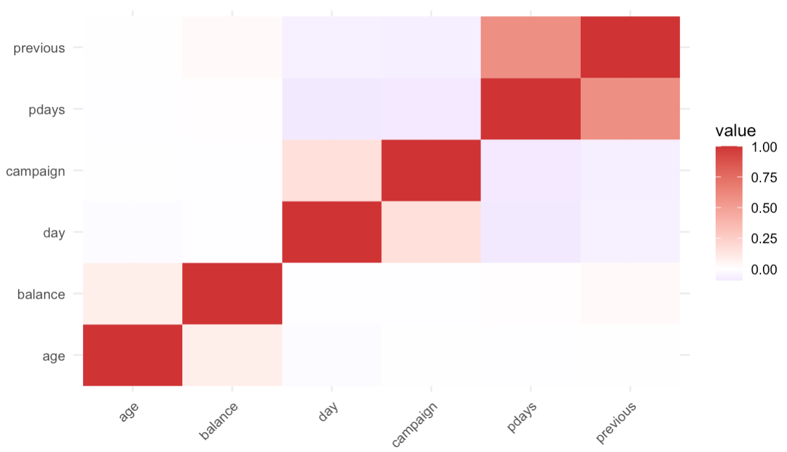
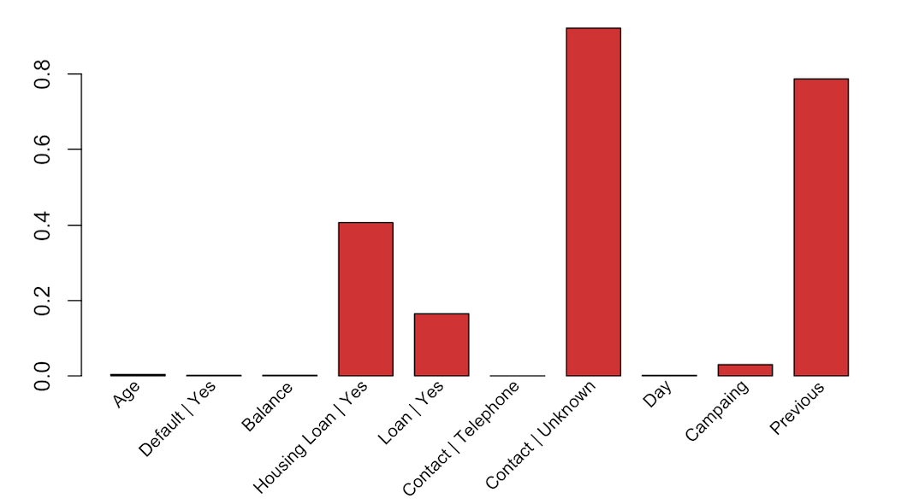
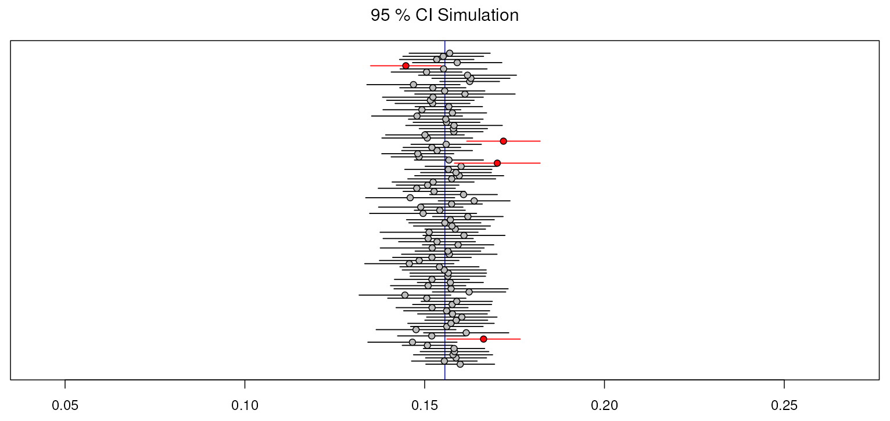
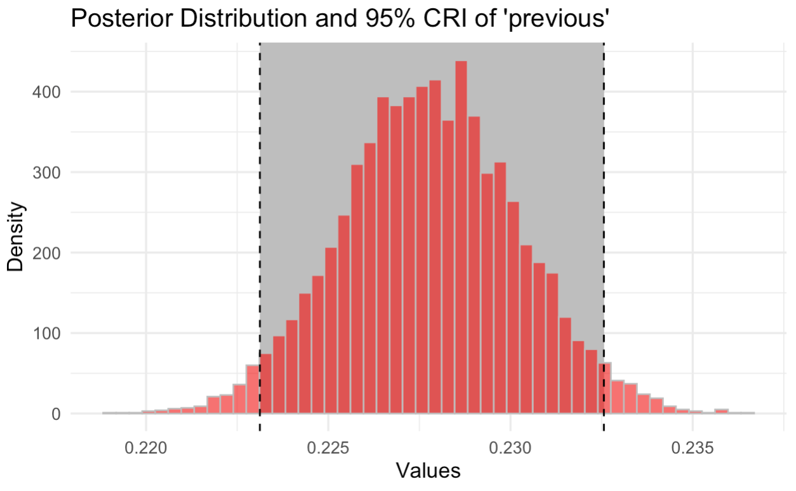

# 📖 About

This repository focuses on data analysis using **Generalized Linear Model (GLM)**, in particular the **Multivariate Logistic Regression** applied to a public dataset from a Portuguese banking institution's marketing campaign, implemented in R.
The aim is to provide an understanding of the differences in philosophy, methodology, and results between the Frequentist and Bayesian approaches, adhering to proper statistical assumptions to ensure the right interpretation of results.

## Authors

- *Vittoria Cassola*
- *Andrea Sciortino*

# Dataset
The [Moro S., Rita P., Cortez P. (2014). Bank Marketing UCI Machine Learning Repository](https://archive.ics.uci.edu/ml/datasets/Bank+Marketing) contains client and campaign features from a Portuguese bank’s direct marketing phone calls, aimed at predicting term deposit subscription decision ('yes' or 'no'). The 'bank.csv' file has been used instead of 'bank_full.csv' for computational reasons.

## Project Structure:

1. **Data Preprocessing**: The dataset undergoes cleaning, feature selection, and transformation to ensure the quality and relevance of the input variables.
2. **Modeling Approaches**:
   - **Frequentist Approach**: The model estimate parameter with maximum likelihood regression methods.
   - **Bayesian Approach**: A probabilistic linear regression model is used, incorporating prior beliefs and updating them with observed data using Bayes' theorem.
3. **Model Evaluation**: Both models are evaluated using various performance metrics, including accuracy, precision, recall, F1-score, and AUC-ROC, to assess and compare their predictive performance.
4. **Interpretation**: Careful interpretation of the model's results is emphasized, ensuring that the conclusions drawn are statistically valid and meaningful.

# 💡 Results

Using the *Covariance Matrix* to eliminate correleted varaibles and *Bayesian Feature Selection using Latent Variables* to identify the most influential predictors, the model is fitted on a subset that consider: 

 - `housing | Yes`
 - `loan | Yes`
 - `campaign`
 - `previous`

| Covariance Matrix | Bayesian Feature Selection |
|---------|---------|
|  |  |

Similar estimation of the parameters was obtained for both approaches, but now with a uncertainty measure from simulations.

Regression coefficients indicate how changes in the independent variables are associated with changes in the dependent variable. However, the interpretation of these coefficients from a statistical standpoint differs between Frequentist and Bayesian perspectives:

***Frequentist interpretation***:
> *If the experiment were repeated many times, in the long run, 100(1-⍺)% of the calculated intervals would contain the true but fixed parameter.*

- This approach assumes the possibility of infinitely repeating the experiment under identical conditions.
- The frequentist confidence interval provides information only about the reliability of the interval and **not** about the uncertainty of the parameter itself.
- The parameter is treated as a fixed, unknown constant, and no probabilistic statements can be made directly about it.

***Bayesian interpretation***:
> *the interval with probability 100(1-⍺)% contain the true parameter considered as a random variable*.

- In this framework, the parameter is considered a random variable with a probability distribution that reflects its uncertainty.
- The Bayesian interpretation is inherently more intuitive, as it provides a direct probabilistic statement about the parameter's uncertainty.
- This interpretation relies solely on the given experiment and does not require assumptions about repeating it.

| Frequentist | Bayesian |
|---------|---------|
|  |  |
